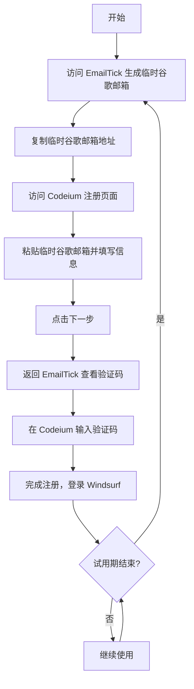

# ♾️ Windsurf 无限试用指南

## 📋 项目简介

本指南提供了一种使用临时谷歌邮箱在 [Codeium](https://codeium.com) 平台上无限次创建试用账号的方法，从而实现 Windsurf 的无限试用。通过使用 [EmailTick](https://www.emailtick.com) 生成临时谷歌邮箱地址，您可以轻松地在 Codeium 平台注册新账号，进而获取 Windsurf 的试用权限，延长试用期限。

## 📧 关于临时谷歌邮箱

本指南推荐使用 [EmailTick](https://www.emailtick.com) 作为临时谷歌邮箱服务，因为它简单易用且稳定可靠。当然，您也可以自行在网上寻找其他临时谷歌邮箱服务，市面上有多种选择可供使用。

无论使用哪种服务，请确保它能够接收验证邮件，这对于完成 Codeium 的注册流程至关重要。谷歌邮箱在 Codeium 注册时通常有更高的成功率，因此本指南专注于临时谷歌邮箱服务。

## ⚙️ 使用流程

### 步骤 1: 生成临时谷歌邮箱

1. 访问 [EmailTick](https://www.emailtick.com)
2. 网站会自动生成一个临时谷歌邮箱地址
3. 点击"复制"按钮复制邮箱地址

### 步骤 2: 在 Codeium 注册新账号

1. 访问 [Codeium 注册页面](https://codeium.com/account/register)
2. 将复制的临时谷歌邮箱粘贴到邮箱输入框
3. 填写任意姓名（可随意填写）
4. 设置密码（请记住您的密码以便登录）
5. 点击"下一步"按钮

### 步骤 3: 验证邮箱

1. 返回 [EmailTick](https://www.emailtick.com)
2. 等待 Codeium 发送的验证邮件（通常在几秒钟内到达）
3. 打开验证邮件并复制验证码
4. 返回 Codeium 注册页面，输入验证码
5. 完成注册流程

### 步骤 4: 安装并登录 Windsurf

1. 下载并安装 Windsurf
2. 使用刚注册的 Codeium 账号登录 Windsurf
3. 开始使用 Windsurf 的各项功能

### 步骤 5: 试用期结束后

1. 试用期结束后，重复步骤 1-4
2. 使用新的临时谷歌邮箱重新注册 Codeium 账号并登录 Windsurf
3. 无限循环此过程，持续享受 Windsurf 服务

## 🔄 流程图

## 💡 小技巧

- 如果 EmailTick 暂时无法使用，您可以自行在网上搜索其他临时谷歌邮箱服务
- 谷歌邮箱在 Codeium 注册时通常有更高的成功率，因此本指南专注于临时谷歌邮箱
- 建议记录您使用过的邮箱和对应的密码，以便需要时查阅
- 每次创建新账号时，请确保使用全新的临时邮箱地址

## ⚠️ 免责声明

本项目仅用于学习和研究目的。请遵守相关服务条款和规定。滥用此方法可能违反 Windsurf 和 Codeium 的服务条款。用户需自行承担使用此方法的风险和责任。

## 🌟 贡献

欢迎提出改进建议或报告问题！您可以通过以下方式参与贡献:
- 提交 Pull 请求
- 创建 Issue
- 分享您的使用体验

---

**🚀 快速开始使用 Windsurf 的无限试用之旅！**

